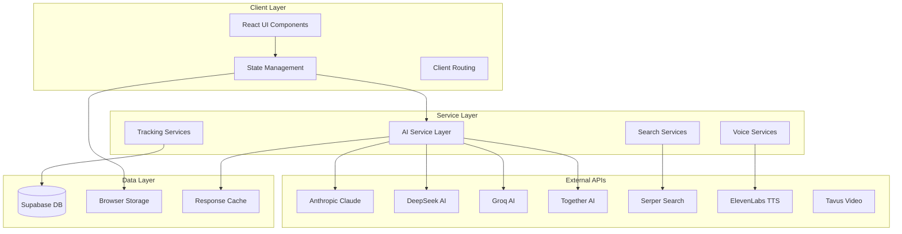
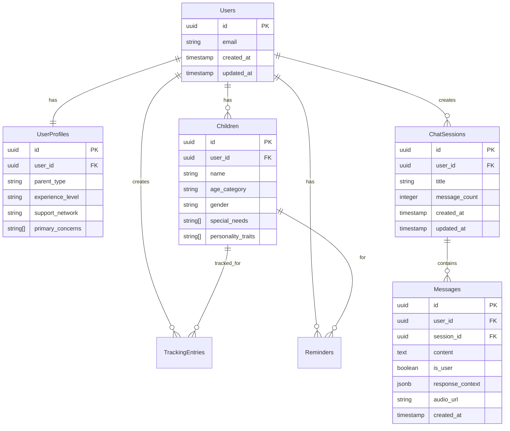

# ParentGPT Architecture Documentation
## System Design and Technical Architecture

### Table of Contents
1. [System Overview](#system-overview)
2. [Frontend Architecture](#frontend-architecture)
3. [AI Intelligence Layer](#ai-intelligence-layer)
4. [Data Architecture](#data-architecture)
5. [Service Layer](#service-layer)
6. [Security Architecture](#security-architecture)
7. [Performance Architecture](#performance-architecture)
8. [Scalability Considerations](#scalability-considerations)

---

## System Overview

### High-Level Architecture



### Core Principles

#### 1. **Modularity**
- Loosely coupled components
- Service-oriented architecture
- Clear separation of concerns
- Pluggable AI providers

#### 2. **Resilience**
- Graceful degradation
- Multiple fallback mechanisms
- Error boundary implementation
- Offline-first capabilities

#### 3. **Performance**
- Lazy loading strategies
- Intelligent caching
- Optimistic UI updates
- Minimal re-renders

#### 4. **Security**
- Client-side encryption
- Secure API key management
- Row-level security
- Input validation

---

## Frontend Architecture

### Component Hierarchy

```
App (Root Container)
├── ThemeProvider (Global Context)
├── ErrorBoundary (Error Handling)
├── MainSidebar (Navigation Hub)
│   ├── ChatSidebar (Conversation Management)
│   ├── TrackingPanel (Wellness Monitoring)
│   └── SettingsPanel (Configuration)
├── ChatInterface (Main Interaction Area)
│   ├── MessageList (Conversation Display)
│   ├── MessageInput (User Input)
│   ├── VoiceAssistant (Speech Interface)
│   └── VirtualPediatrician (Video AI)
└── BoltBadge (Attribution)
```

### State Management Architecture

#### **React Hooks Pattern**
```typescript
// Centralized state management
const useAppState = () => {
  const [sessions, setSessions] = useState<ChatSession[]>([]);
  const [currentSession, setCurrentSession] = useState<ChatSession | null>(null);
  const [apiStatus, setApiStatus] = useState<APIStatus>({});
  const [user, setUser] = useState<User | null>(null);
  
  // State synchronization
  useEffect(() => {
    syncWithLocalStorage();
    syncWithSupabase();
  }, []);
  
  return {
    sessions,
    currentSession,
    apiStatus,
    user,
    actions: {
      createSession,
      updateSession,
      deleteSession
    }
  };
};
```

#### **Context API Usage**
```typescript
// Theme management
const ThemeContext = createContext<ThemeContextType>();

// Global state provider
const AppStateContext = createContext<AppStateType>();

// Service context for dependency injection
const ServiceContext = createContext<ServiceContainer>();
```

### Component Design Patterns

#### 1. **Container/Presentational Pattern**
```typescript
// Container Component (Logic)
const ChatContainer: React.FC = () => {
  const [messages, setMessages] = useState<Message[]>([]);
  const [isLoading, setIsLoading] = useState(false);
  
  const handleSendMessage = async (text: string) => {
    // Business logic
  };
  
  return (
    <ChatPresentation
      messages={messages}
      isLoading={isLoading}
      onSendMessage={handleSendMessage}
    />
  );
};

// Presentational Component (UI)
const ChatPresentation: React.FC<ChatProps> = ({
  messages,
  isLoading,
  onSendMessage
}) => {
  return (
    <div className="chat-interface">
      {/* Pure UI rendering */}
    </div>
  );
};
```

#### 2. **Custom Hooks Pattern**
```typescript
// Reusable business logic
const useVoiceRecognition = () => {
  const [isListening, setIsListening] = useState(false);
  const [transcript, setTranscript] = useState('');
  
  const startListening = useCallback(() => {
    // Voice recognition logic
  }, []);
  
  const stopListening = useCallback(() => {
    // Stop logic
  }, []);
  
  return {
    isListening,
    transcript,
    startListening,
    stopListening
  };
};
```

#### 3. **Higher-Order Components (HOCs)**
```typescript
// Error boundary wrapper
const withErrorBoundary = <P extends object>(
  Component: React.ComponentType<P>
) => {
  return (props: P) => (
    <ErrorBoundary>
      <Component {...props} />
    </ErrorBoundary>
  );
};

// Loading state wrapper
const withLoading = <P extends object>(
  Component: React.ComponentType<P>
) => {
  return (props: P & { isLoading?: boolean }) => {
    if (props.isLoading) {
      return <LoadingSpinner />;
    }
    return <Component {...props} />;
  };
};
```

---

## AI Intelligence Layer

### Multi-Provider Architecture

```typescript
interface AIProvider {
  name: string;
  apiKey: string | undefined;
  endpoint: string;
  model: string;
  maxTokens: number;
  temperature: number;
  priority: number;
  capabilities: AICapability[];
}

interface AICapability {
  type: 'reasoning' | 'empathy' | 'speed' | 'creativity';
  score: number; // 1-10
}
```

### Intelligent Provider Selection

```typescript
class ProviderSelector {
  static selectOptimalProvider(
    question: QuestionAnalysis,
    availableProviders: AIProvider[]
  ): AIProvider {
    // Score providers based on question characteristics
    const scoredProviders = availableProviders.map(provider => ({
      provider,
      score: this.calculateProviderScore(provider, question)
    }));
    
    // Return highest scoring provider
    return scoredProviders
      .sort((a, b) => b.score - a.score)[0]
      .provider;
  }
  
  private static calculateProviderScore(
    provider: AIProvider,
    question: QuestionAnalysis
  ): number {
    let score = provider.priority;
    
    // Adjust based on question requirements
    if (question.requiresEmpathy) {
      score += provider.capabilities
        .find(c => c.type === 'empathy')?.score || 0;
    }
    
    if (question.complexity === 'high') {
      score += provider.capabilities
        .find(c => c.type === 'reasoning')?.score || 0;
    }
    
    if (question.urgency === 'high') {
      score += provider.capabilities
        .find(c => c.type === 'speed')?.score || 0;
    }
    
    return score;
  }
}
```

### Context Management System

```typescript
class ContextManager {
  private static conversationMemory = new Map<string, ConversationContext>();
  
  static buildContext(
    question: string,
    sessionId: string,
    userProfile?: UserProfile
  ): EnhancedContext {
    const conversationHistory = this.getConversationHistory(sessionId);
    const sessionContext = this.getSessionContext(sessionId);
    const userContext = this.getUserContext(userProfile);
    
    return {
      question,
      conversationHistory,
      sessionContext,
      userContext,
      timestamp: new Date().toISOString(),
      metadata: this.extractMetadata(question)
    };
  }
  
  static updateConversationMemory(
    sessionId: string,
    question: string,
    response: string
  ): void {
    const context = this.conversationMemory.get(sessionId) || {
      messages: [],
      topics: new Set(),
      sentiment: 'neutral'
    };
    
    context.messages.push(
      { role: 'user', content: question, timestamp: Date.now() },
      { role: 'assistant', content: response, timestamp: Date.now() }
    );
    
    // Maintain memory limits
    if (context.messages.length > 20) {
      context.messages = context.messages.slice(-20);
    }
    
    this.conversationMemory.set(sessionId, context);
  }
}
```

### Response Quality Assessment

```typescript
class QualityAssessor {
  static assessResponse(
    response: string,
    context: EnhancedContext,
    provider: AIProvider
  ): QualityMetrics {
    return {
      confidence: this.calculateConfidence(response, context),
      relevance: this.assessRelevance(response, context.question),
      completeness: this.assessCompleteness(response),
      safety: this.assessSafety(response),
      empathy: this.assessEmpathy(response, context),
      actionability: this.assessActionability(response)
    };
  }
  
  private static calculateConfidence(
    response: string,
    context: EnhancedContext
  ): number {
    let confidence = 0.7; // Base confidence
    
    // Length and structure indicators
    if (response.length > 500) confidence += 0.1;
    if (response.includes('**') && response.includes('•')) confidence += 0.05;
    
    // Evidence-based indicators
    if (response.includes('research') || response.includes('study')) {
      confidence += 0.1;
    }
    
    // Context utilization
    if (context.webSearchResults) confidence += 0.1;
    if (context.conversationHistory?.length > 0) confidence += 0.05;
    
    return Math.min(confidence, 0.95);
  }
}
```

---

## Data Architecture

### Database Schema Design

#### **Entity Relationship Model**


#### **Data Access Patterns**
```typescript
// Repository pattern for data access
class ChatRepository {
  static async createSession(userId: string, title: string): Promise<ChatSession> {
    const { data, error } = await supabase
      .from('chat_sessions')
      .insert([{ user_id: userId, title }])
      .select()
      .single();
    
    if (error) throw new DatabaseError(error.message);
    return data;
  }
  
  static async getSessionsForUser(userId: string): Promise<ChatSession[]> {
    const { data, error } = await supabase
      .from('chat_sessions')
      .select(`
        *,
        messages(count)
      `)
      .eq('user_id', userId)
      .order('updated_at', { ascending: false });
    
    if (error) throw new DatabaseError(error.message);
    return data;
  }
}
```

### Caching Strategy

#### **Multi-Level Caching**
```typescript
class CacheManager {
  private static memoryCache = new Map<string, CacheEntry>();
  private static readonly CACHE_TTL = 5 * 60 * 1000; // 5 minutes
  
  // Level 1: Memory Cache
  static getFromMemory<T>(key: string): T | null {
    const entry = this.memoryCache.get(key);
    if (!entry || Date.now() > entry.expiry) {
      this.memoryCache.delete(key);
      return null;
    }
    return entry.data;
  }
  
  static setInMemory<T>(key: string, data: T, ttl = this.CACHE_TTL): void {
    this.memoryCache.set(key, {
      data,
      expiry: Date.now() + ttl
    });
  }
  
  // Level 2: Local Storage Cache
  static getFromStorage<T>(key: string): T | null {
    try {
      const item = localStorage.getItem(`cache_${key}`);
      if (!item) return null;
      
      const parsed = JSON.parse(item);
      if (Date.now() > parsed.expiry) {
        localStorage.removeItem(`cache_${key}`);
        return null;
      }
      
      return parsed.data;
    } catch {
      return null;
    }
  }
  
  static setInStorage<T>(key: string, data: T, ttl = this.CACHE_TTL): void {
    try {
      localStorage.setItem(`cache_${key}`, JSON.stringify({
        data,
        expiry: Date.now() + ttl
      }));
    } catch (error) {
      console.warn('Failed to cache in localStorage:', error);
    }
  }
}
```

### Data Synchronization

#### **Optimistic Updates**
```typescript
class DataSynchronizer {
  static async optimisticUpdate<T>(
    localUpdate: () => void,
    serverUpdate: () => Promise<T>,
    rollback: () => void
  ): Promise<T> {
    // Apply local update immediately
    localUpdate();
    
    try {
      // Sync with server
      const result = await serverUpdate();
      return result;
    } catch (error) {
      // Rollback on failure
      rollback();
      throw error;
    }
  }
}

// Usage example
const addMessage = async (message: Message) => {
  return DataSynchronizer.optimisticUpdate(
    () => {
      // Immediate UI update
      setMessages(prev => [...prev, message]);
    },
    () => {
      // Server sync
      return MessageRepository.create(message);
    },
    () => {
      // Rollback
      setMessages(prev => prev.filter(m => m.id !== message.id));
    }
  );
};
```

---

## Service Layer

### Service Architecture Pattern

```typescript
// Base service interface
interface Service {
  initialize(): Promise<void>;
  isConfigured(): boolean;
  getStatus(): ServiceStatus;
}

// Service container for dependency injection
class ServiceContainer {
  private services = new Map<string, Service>();
  
  register<T extends Service>(name: string, service: T): void {
    this.services.set(name, service);
  }
  
  get<T extends Service>(name: string): T {
    const service = this.services.get(name);
    if (!service) {
      throw new Error(`Service ${name} not found`);
    }
    return service as T;
  }
  
  async initializeAll(): Promise<void> {
    const initPromises = Array.from(this.services.values())
      .map(service => service.initialize());
    
    await Promise.allSettled(initPromises);
  }
}
```

### AI Service Implementation

```typescript
class EnhancedAIService implements Service {
  private providers: AIProvider[] = [];
  private contextManager: ContextManager;
  private qualityAssessor: QualityAssessor;
  
  async initialize(): Promise<void> {
    this.providers = this.loadConfiguredProviders();
    this.contextManager = new ContextManager();
    this.qualityAssessor = new QualityAssessor();
  }
  
  isConfigured(): boolean {
    return this.providers.length > 0;
  }
  
  getStatus(): ServiceStatus {
    return {
      available: this.isConfigured(),
      providers: this.providers.map(p => ({
        name: p.name,
        status: this.checkProviderHealth(p)
      }))
    };
  }
  
  async generateResponse(
    question: string,
    context: AIContext
  ): Promise<AIResponse> {
    // Implementation details...
  }
}
```

### Error Handling Strategy

```typescript
// Custom error types
class ParentGPTError extends Error {
  constructor(
    message: string,
    public code: string,
    public details?: any
  ) {
    super(message);
    this.name = 'ParentGPTError';
  }
}

class AIProviderError extends ParentGPTError {
  constructor(provider: string, originalError: Error) {
    super(
      `AI Provider ${provider} failed: ${originalError.message}`,
      'AI_PROVIDER_ERROR',
      { provider, originalError }
    );
  }
}

// Global error handler
class ErrorHandler {
  static handle(error: Error, context?: any): void {
    // Log error
    console.error('ParentGPT Error:', error, context);
    
    // Report to monitoring service
    this.reportError(error, context);
    
    // Show user-friendly message
    this.showUserMessage(error);
  }
  
  private static showUserMessage(error: Error): void {
    if (error instanceof AIProviderError) {
      toast.error('AI service temporarily unavailable. Using offline mode.');
    } else if (error instanceof DatabaseError) {
      toast.error('Unable to save data. Please try again.');
    } else {
      toast.error('Something went wrong. Please refresh and try again.');
    }
  }
}
```

---

## Security Architecture

### Client-Side Security

#### **Input Validation**
```typescript
class InputValidator {
  static validateUserInput(input: string): ValidationResult {
    const errors: string[] = [];
    
    // Length validation
    if (input.length > 2000) {
      errors.push('Input too long (max 2000 characters)');
    }
    
    // Content validation
    const prohibitedPatterns = [
      /<script\b[^<]*(?:(?!<\/script>)<[^<]*)*<\/script>/gi,
      /javascript:/gi,
      /data:text\/html/gi,
      /vbscript:/gi
    ];
    
    for (const pattern of prohibitedPatterns) {
      if (pattern.test(input)) {
        errors.push('Input contains prohibited content');
        break;
      }
    }
    
    return {
      isValid: errors.length === 0,
      errors,
      sanitized: this.sanitizeInput(input)
    };
  }
  
  private static sanitizeInput(input: string): string {
    return input
      .replace(/</g, '&lt;')
      .replace(/>/g, '&gt;')
      .replace(/"/g, '&quot;')
      .replace(/'/g, '&#x27;')
      .replace(/\//g, '&#x2F;');
  }
}
```

#### **API Key Protection**
```typescript
class APIKeyManager {
  private static encryptionKey: string;
  
  static async initialize(): Promise<void> {
    // Generate or retrieve encryption key
    this.encryptionKey = await this.getOrCreateEncryptionKey();
  }
  
  static encryptAPIKey(apiKey: string): string {
    // Client-side encryption for sensitive keys
    return CryptoJS.AES.encrypt(apiKey, this.encryptionKey).toString();
  }
  
  static decryptAPIKey(encryptedKey: string): string {
    const bytes = CryptoJS.AES.decrypt(encryptedKey, this.encryptionKey);
    return bytes.toString(CryptoJS.enc.Utf8);
  }
  
  private static async getOrCreateEncryptionKey(): Promise<string> {
    let key = localStorage.getItem('pgpt_ek');
    if (!key) {
      key = CryptoJS.lib.WordArray.random(256/8).toString();
      localStorage.setItem('pgpt_ek', key);
    }
    return key;
  }
}
```

### Data Privacy

#### **PII Detection and Masking**
```typescript
class PrivacyProtector {
  private static readonly PII_PATTERNS = {
    ssn: /\b\d{3}-\d{2}-\d{4}\b/g,
    phone: /\b\d{3}-\d{3}-\d{4}\b/g,
    email: /\b[A-Za-z0-9._%+-]+@[A-Za-z0-9.-]+\.[A-Z|a-z]{2,}\b/g,
    creditCard: /\b\d{4}[\s-]?\d{4}[\s-]?\d{4}[\s-]?\d{4}\b/g
  };
  
  static detectPII(text: string): PIIDetectionResult {
    const detected: PIIMatch[] = [];
    
    for (const [type, pattern] of Object.entries(this.PII_PATTERNS)) {
      const matches = text.match(pattern);
      if (matches) {
        detected.push(...matches.map(match => ({ type, value: match })));
      }
    }
    
    return {
      hasPII: detected.length > 0,
      detected,
      masked: this.maskPII(text)
    };
  }
  
  private static maskPII(text: string): string {
    let masked = text;
    
    for (const [type, pattern] of Object.entries(this.PII_PATTERNS)) {
      masked = masked.replace(pattern, `[${type.toUpperCase()}]`);
    }
    
    return masked;
  }
}
```

---

## Performance Architecture

### Optimization Strategies

#### **Component Optimization**
```typescript
// Memoization for expensive components
const ExpensiveComponent = React.memo(({ data, onUpdate }) => {
  const processedData = useMemo(() => {
    return expensiveDataProcessing(data);
  }, [data]);
  
  const handleUpdate = useCallback((id: string) => {
    onUpdate(id);
  }, [onUpdate]);
  
  return (
    <div>
      {processedData.map(item => (
        <Item key={item.id} data={item} onUpdate={handleUpdate} />
      ))}
    </div>
  );
});

// Virtual scrolling for large lists
const VirtualizedMessageList = ({ messages }) => {
  const [visibleRange, setVisibleRange] = useState({ start: 0, end: 50 });
  
  const visibleMessages = useMemo(() => {
    return messages.slice(visibleRange.start, visibleRange.end);
  }, [messages, visibleRange]);
  
  return (
    <div className="message-list" onScroll={handleScroll}>
      {visibleMessages.map(message => (
        <Message key={message.id} data={message} />
      ))}
    </div>
  );
};
```

#### **Bundle Optimization**
```typescript
// Code splitting by route
const TrackingPanel = lazy(() => import('./components/TrackingPanel'));
const SettingsPanel = lazy(() => import('./components/SettingsPanel'));

// Dynamic imports for heavy libraries
const loadChartLibrary = async () => {
  const { Chart } = await import('chart.js');
  return Chart;
};

// Service worker for caching
if ('serviceWorker' in navigator) {
  navigator.serviceWorker.register('/sw.js')
    .then(registration => {
      console.log('SW registered:', registration);
    })
    .catch(error => {
      console.log('SW registration failed:', error);
    });
}
```

### Monitoring and Analytics

```typescript
class PerformanceMonitor {
  static measureComponentRender(componentName: string) {
    return (target: any, propertyName: string, descriptor: PropertyDescriptor) => {
      const method = descriptor.value;
      
      descriptor.value = function (...args: any[]) {
        const start = performance.now();
        const result = method.apply(this, args);
        const end = performance.now();
        
        console.log(`${componentName}.${propertyName} took ${end - start} ms`);
        
        return result;
      };
    };
  }
  
  static trackUserInteraction(action: string, metadata?: any): void {
    // Track user interactions for UX optimization
    const event = {
      action,
      timestamp: Date.now(),
      metadata,
      sessionId: this.getSessionId(),
      userAgent: navigator.userAgent
    };
    
    // Send to analytics service
    this.sendAnalytics(event);
  }
}
```

---

## Scalability Considerations

### Horizontal Scaling

#### **Microservices Architecture (Future)**
```typescript
// Service mesh for AI providers
interface AIServiceMesh {
  providers: AIProviderService[];
  loadBalancer: LoadBalancer;
  circuitBreaker: CircuitBreaker;
  rateLimiter: RateLimiter;
}

// Load balancing strategy
class LoadBalancer {
  private providers: AIProviderService[];
  
  selectProvider(request: AIRequest): AIProviderService {
    // Round-robin, least connections, or weighted selection
    return this.providers.find(p => p.isAvailable()) || this.providers[0];
  }
}

// Circuit breaker pattern
class CircuitBreaker {
  private failures = new Map<string, number>();
  private readonly threshold = 5;
  private readonly timeout = 60000; // 1 minute
  
  async execute<T>(
    providerId: string,
    operation: () => Promise<T>
  ): Promise<T> {
    if (this.isOpen(providerId)) {
      throw new Error(`Circuit breaker open for ${providerId}`);
    }
    
    try {
      const result = await operation();
      this.onSuccess(providerId);
      return result;
    } catch (error) {
      this.onFailure(providerId);
      throw error;
    }
  }
  
  private isOpen(providerId: string): boolean {
    const failures = this.failures.get(providerId) || 0;
    return failures >= this.threshold;
  }
}
```

### Database Scaling

#### **Read Replicas and Caching**
```typescript
// Database connection pool
class DatabasePool {
  private readReplicas: SupabaseClient[];
  private writeInstance: SupabaseClient;
  
  async read<T>(query: () => Promise<T>): Promise<T> {
    const replica = this.selectReadReplica();
    return query.call(replica);
  }
  
  async write<T>(query: () => Promise<T>): Promise<T> {
    return query.call(this.writeInstance);
  }
  
  private selectReadReplica(): SupabaseClient {
    // Load balancing logic for read replicas
    return this.readReplicas[
      Math.floor(Math.random() * this.readReplicas.length)
    ];
  }
}
```

### CDN and Edge Computing

```typescript
// Edge function for AI processing
export default async function handler(request: Request) {
  const { question, context } = await request.json();
  
  // Process at edge for reduced latency
  const response = await processAIRequest(question, context);
  
  return new Response(JSON.stringify(response), {
    headers: {
      'Content-Type': 'application/json',
      'Cache-Control': 'public, max-age=300' // 5 minutes
    }
  });
}
```

---

This architecture documentation provides a comprehensive overview of ParentGPT's technical design, from frontend components to backend services, security measures, and scalability considerations. The modular, service-oriented approach ensures maintainability and extensibility as the platform grows.